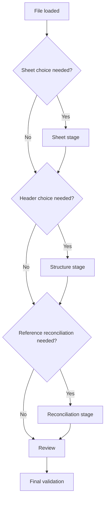
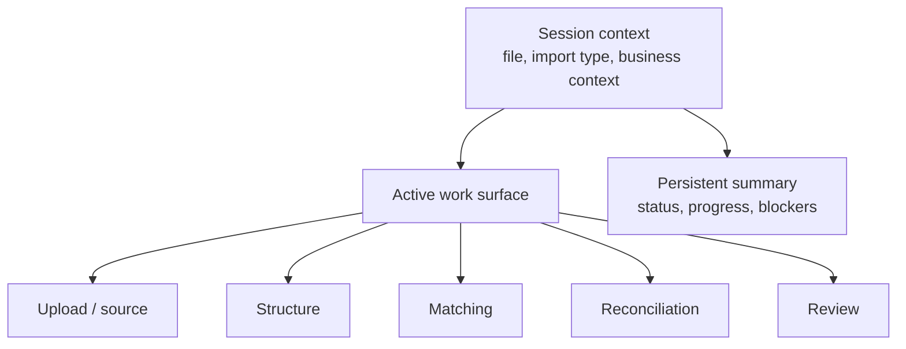

# Spreadsheet Import - UX Brief for an AI Design Agent

> Mission:
>
> Design a premium spreadsheet import experience that is dense, readable, operationally trustworthy, and well suited to back-office and dashboard-style applications.

---

## 1. Why this brief exists

This document is written for an **AI agent doing UX/UI design work**.

Unlike a purely creative brief, this one assumes the agent can understand:

- complex functional constraints
- conditional flows
- mapping and reconciliation logic
- context-dependent behavior
- a schema/config-driven product model

So the goal is not only to "make it look good".

The goal is to produce a UX/UI proposal that is:

- genuinely strong for real operators
- aligned with the actual product structure
- realistic to implement
- scalable as the import product grows more complex

---

## 2. Product nature

This product is a **tabular data import tool** for business applications.

It should be thought of as part of a:

- back-office product
- admin tool
- business dashboard
- operations workspace

It should not be thought of as:

- consumer onboarding
- a simple upload modal
- a lightweight assistant flow

### UX positioning

| Aim for | Avoid |
|---|---|
| Business processing tool | Generic wizard |
| Strong reading hierarchy | Card pile |
| Useful density | Empty interface |
| Control + clarity | Excessive magic |
| Operational trust | Marketing UI |

---

## 3. Product vision

The user arrives with an Excel or CSV file.

That file may be:

- clean
- partially clean
- badly structured
- ambiguous
- incomplete
- inconsistent with internal platform references

The interface does not merely exist to accept a file.

It exists to help the user:

1. understand the file structure
2. understand how the system interpreted it
3. resolve ambiguities and business mappings
4. identify what blocks submission
5. validate the final result with confidence

---

## 4. Functional model the designer should understand

The product follows a pipeline model.

Even though this is not a technical implementation spec, it is important to understand this model because it should directly influence the design quality.

### Conceptual pipeline

### Important note

These stages do not always all appear.

Some of them may be:

- automatic
- skipped
- visually merged
- hidden if already resolved

The design must therefore **not** assume a rigid fixed-step wizard.

---

## 5. Major structural constraint: adaptive flow

The flow depends on the file, the import context, and the import configuration.

Examples:

- the sheet may be fixed or user-selected
- the header row may be obvious or ambiguous
- column matching may be mostly automatic or partially manual
- reference reconciliation may be absent or central

### Flow variation model

### UX consequence

The interface must support:

- short flows
- long flows
- conditional stages
- stages whose role changes depending on the import definition

---

## 6. Major structural constraint: schema-driven product

The product is not a single fixed import flow.

It is driven by an **import schema/configuration** that defines things such as:

- accepted file types
- sheet resolution strategy
- header strategy
- expected columns
- dynamic columns
- business reference mappings
- final output payload shape

### Why this matters for design

This means the interface must be able to represent cleanly:

- simple imports
- highly complex imports
- fields known up front
- fields generated at runtime
- stages that only exist for some import definitions

The design must therefore be **modular**, not frozen around a single fixed example.

---

## 7. Primary reference use case

The main reference scenario is an **assessment import** flow.

### This scenario includes

- multiple possible sheets
- noise rows before the real header row
- dynamic columns depending on organization or test center
- imported exam names that do not exactly match internal products
- valid and invalid rows
- a meaningful review step before submission

### Concrete examples

- `School level: PRÉREQUIS CECR`
- `Programme: PREREQUIS CECR`
- `VTest Business English | 4 Skills`
- `VTEST ENGLISH - 4 SKILLS`
- missing required values
- unknown option values
- uncertain business mappings

---

## 8. Target users

| Profile | Technical level | Main need |
|---|---|---|
| Ops / admin | Low to medium | Move fast and avoid mistakes |
| Support / implementation | Medium to high | Understand the system logic and handle harder cases |
| Recurrent business user | Low | Be guided without losing control |

### What they all want

- to know where they are
- to understand what is blocking
- to correct issues quickly
- to avoid row-by-row repetitive work
- to validate confidently

---

## 9. UX objects the interface must represent

The product does not only manipulate a file.

It manipulates multiple information layers.

### Important layers

| Layer | Description | UX implication |
|---|---|---|
| Source | Raw file, sheets, raw rows | Needs structural reading |
| Structure | Active sheet, active header row | Conditions everything downstream |
| Matching | Source columns ↔ expected fields | Must be inspectable and trustworthy |
| Reconciliation | External values ↔ internal entities | Must feel like a real business tool |
| Review | Valid rows, invalid rows, issues, final payload | Must support decision-making |

### UX consequence

The UI should probably separate clearly:

- **session context**
- **active work area**
- **global progress / health summary**

---

## 10. Experience structure direction

The designer can diverge on the exact form, but the overall experience should likely resemble something like this:

### Intent

The product should read like a **workspace**, not a sequence of disconnected screens.

---

## 11. Functional stages the design must cover

## A. Upload / source

### Goal

Bring the file into the system and immediately reassure the user about what has been loaded.

### Must cover

- empty state
- drag & drop
- file picking
- parsing state
- error state
- file summary
- action to download or generate an example/template file

### UX challenge

Upload should be prominent at the beginning, but should not dominate the screen once the file is loaded.

---

## B. Structure

### Goal

Help the user confirm that the system is reading the right sheet and the right header row.

### Must cover

- sheet choice
- header row choice
- raw source preview
- clear highlighting of the active header row
- obvious feedback if the wrong structure is selected

### UX challenge

Show enough structural context to support a confident decision, without turning the screen into a giant unreadable spreadsheet.

---

## C. Column matching

### Goal

Show how source columns have been interpreted by the system.

### Must cover

- recognized columns
- unrecognized columns
- missing required fields
- dynamic columns expected from runtime context
- possible confidence indicators

### UX challenge

The product must make it easy to see:

- what is fine
- what is uncertain
- what prevents the user from moving forward confidently

---

## D. Business reconciliation

### Goal

Map imported external values to internal platform entities.

### Concrete case

| Imported value | Internal value |
|---|---|
| External exam name | Internal product |

### Essential structural rule

Reconciliation happens on **distinct source values**, not row by row.

Example:

- if 120 rows contain the same imported value
- the user should resolve it once
- that resolution should apply to all impacted rows

### Representation

### UX challenge

This stage must feel like a **reconciliation tool**, not a list of generic form controls.

---

## E. Review

### Goal

Support a validation decision.

### Must cover

- row volume
- valid / invalid rows
- blocking issues
- non-blocking issues
- unresolved mappings
- transformed data preview
- final payload preview when useful

### UX challenge

The goal is not to show everything.
The goal is to show **what enables confident decision-making**.

---

## F. Final validation

### Goal

Clearly communicate what will be imported and let the user confirm the action.

### Must cover

- ready-to-submit state
- blocked state
- useful summary
- clear success exit state

---

## 12. Dynamic columns: key product constraint

Some columns do not exist until runtime context has been loaded.

Example:

- a test center determines a list of affiliation groups
- each group becomes one or more expected columns

### UX implication

The design must be able to show:

- that part of the expected structure depends on context
- which columns were generated
- whether those columns were recognized or not

The designer should not imagine a UI frozen around a static list of fields.

---

## 13. Internal references / mapping: key product constraint

The system sometimes needs to map external values to internal objects.

Examples:

- exam name → product
- school name → school id
- external value → internal enum

### UX implication

The design must think in terms of:

- batches
- suggestions
- confidence
- exceptions
- search
- fast correction

Not in terms of:

- repetitive form filling
- per-row editing

---

## 14. Technical awareness that should improve the design

The AI design agent should use the following product structure to produce a better result:

### The flow is data-driven

The interface should reflect computed states, not arbitrary stages.

### The system distinguishes multiple data states

The product differentiates between:

- raw source data
- matched columns
- parsed rows
- resolved / unresolved mappings
- final submit-ready output

### The system may be highly automatic with a few hard exceptions

The design must work well in all of these cases:

- everything is clean
- almost everything is clean
- only a few blocking items remain
- many items are ambiguous

---

## 15. Questions the user should always be able to answer

At any moment, the user should be able to answer:

1. Which file am I working on?
2. Which structure is currently selected?
3. What did the system understand automatically?
4. What still needs my intervention?
5. What is blocking submission?
6. What will the final import contain?

---

## 16. Visual direction

### Desired style

- premium but restrained
- dense but readable
- structured
- serious
- productivity-oriented

### Mental model

Think:

- business dashboard
- modern back-office
- operations interface

Not:

- landing page
- playful consumer UI
- overly soft onboarding UI

---

## 17. Imposed design system

The implementation will be built on top of **Nuxt UI**.

The design should therefore be ambitious, but realistic within that system.

### References to use

- [Nuxt UI docs](https://ui.nuxt.com)
- [Nuxt UI - Community Figma file](https://www.figma.com/community/file/1544369209862884086)

### Consequences

- rely as much as possible on patterns compatible with Nuxt UI
- think in reusable components and repeatable surfaces
- avoid proposals that assume a fully bespoke design system from scratch

---

## 18. States that must be explicitly designed

## Upload

- empty
- active drag state
- parsing
- error
- file loaded

## Structure

- obvious single-sheet case
- multi-sheet case
- obvious header case
- ambiguous header case
- wrong header selected

## Matching

- everything recognized
- partially recognized
- required fields missing
- dynamic columns visible

## Reconciliation

- nothing to do
- everything auto-resolved
- a few values need resolution
- no useful suggestions
- many distinct values require action

## Review

- healthy import
- partially broken import
- blocked import
- transformed data preview

## Finalization

- ready to submit
- success
- start again

---

## 19. Expected deliverables

| Deliverable | Expected outcome |
|---|---|
| Experience overview | A strong proposal for the overall workflow structure |
| Wireframes | Clear information hierarchy and surface organization |
| Detailed desktop screens | Main stages and critical states |
| State variations | Errors, ambiguities, blockers, resolved cases |
| Reusable patterns | Global summary, structure tools, reconciliation, review, statuses |
| Responsive principles | Rules for non-desktop adaptation |

---

## 20. Things to avoid

- designing only the happy path
- treating import as a simple upload modal
- over-investing in the first screen and under-designing the rest
- stacking cards with weak hierarchy
- turning reconciliation into a simple form list
- hiding real blockers behind an overly soft or vague UI

---

## 21. Guiding sentence

> Design a spreadsheet import workspace that combines the rigor of a back-office tool, the readability of a strong business dashboard, and the flexibility required to handle messy files and complex mapping scenarios.

---

## 22. Important note

The current UI is not a creative reference.

It exposes some functional capabilities, but it is not the right product answer.

The expected work here is a real UX/UI proposal that can express:

- an adaptive import pipeline
- simple and complex scenarios
- dynamic columns
- business reconciliation
- useful review surfaces
- credible final validation
